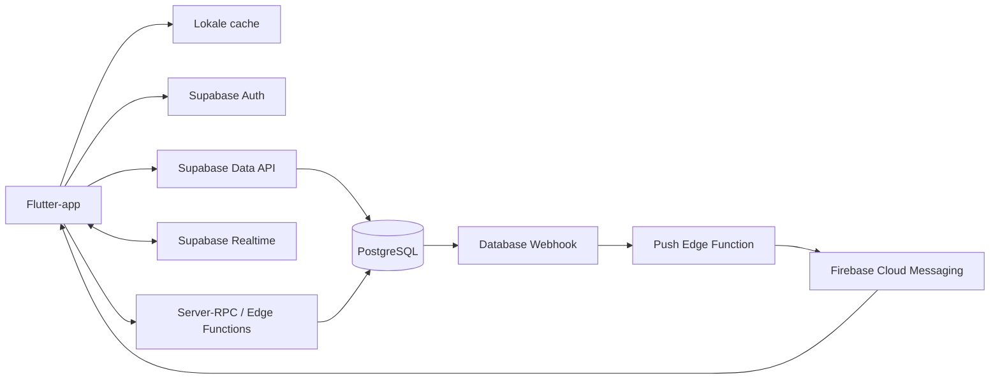

# DragonHaven Online & Friends Implementation Plan

Status: ontwerp voor toekomstige implementatie
Datum: 24 augustus 2026
Doelapp: DragonHaven vanaf v0.01.08
Voorkeursbackend: Supabase Free, met Firebase Cloud Messaging voor pushnotificaties

## 1. Besluit in het kort

DragonHaven blijft eerst en vooral een rustige collectiegame. Online functies
worden als een veilige laag bovenop het bestaande offline spel gebouwd. De
aanbevolen eerste online versie bevat:

- een Dragonkeeper-account dat anoniem kan beginnen en later wordt gekoppeld;
- een unieke, deelbare vriendcode zonder openbare spelerszoekmachine;
- vriendverzoeken, accepteren, verwijderen en blokkeren;
- alleen-lezen bezoeken aan de Tower van vrienden;
- een cosmetische gastdraak die nooit van eigenaar verandert;
- veilige, tweezijdige trades;
- realtime updates en pushnotificaties;
- herstel en synchronisatie op een nieuw apparaat;
- later gedeelde Group Adventures.

Supabase is hiervoor de beste eerste keuze. De relationele PostgreSQL-database
past goed bij vriendschappen, eigendom, transacties en auditlogs. Auth, database,
Realtime, serverfuncties en beveiligingsregels zijn in één platform aanwezig.
De gratis laag is geschikt voor ontwikkeling en een kleine bèta, maar gratis
gebruik of ononderbroken beschikbaarheid kan niet voor altijd worden
gegarandeerd.

## 2. Productprincipes

Deze regels zijn leidend bij iedere technische en visuele keuze:

1. **Collectiegame, geen competitiegame.** Geen battles, PvP, leaderboard of
   mechaniek waarbij spelers van elkaar kunnen verliezen.
2. **Offline blijft speelbaar.** Zonder internet blijven de eigen Tower,
   draken, verzorging en lokale content bruikbaar.
3. **De server beslist over ruilbare waarde.** Een APK mag nooit zelf coins,
   gems, eggs of andere ruilbare voorwerpen aan een cloudaccount toevoegen.
4. **Geen stil dataverlies.** Migratie, synchronisatie en trades zijn
   herhaalbaar en idempotent.
5. **Privacy als standaard.** Exacte vriendcodes in plaats van een openbare
   spelerslijst; e-mailadressen worden nooit aan andere spelers getoond.
6. **Geen pay-to-win.** Eventuele aankopen komen pas later en geven geen
   competitief voordeel.
7. **Veilige uitrol.** Iedere online functie krijgt een feature flag en kan
   onafhankelijk worden geactiveerd of teruggedraaid.
8. **Alle talen blijven ondersteund.** Nieuwe vaste UI, fouten,
   notificaties en tutorialstappen worden meteen in alle ondersteunde talen
   toegevoegd.

## 3. Wat nu al bestaat

DragonHaven bewaart momenteel één versieerbaar JSON-document onder
`dragon_haven_state_v1` via `SharedPreferences`. Daarin staan onder andere:

- accountnaam en instellingen;
- actieve draak, collectie en incuberend ei;
- egg-, chest- en relic-inventory;
- coins en gems;
- Draconomicon-ontdekkingen en achievements;
- adventures en timers;
- Tower-verdiepingen, furniture en plaatsingen;
- lokale animatie- en notificatiewachtrijen.

Dit blijft bruikbaar als lokale cache en voor offline-only spelers. Het is niet
veilig genoeg als online bron van waarheid: een lokale save kan worden gekopieerd
of aangepast en twee telefoons kunnen tegelijk conflicterende versies opslaan.

De Friends-pagina bevat al visuele placeholders voor:

- een Dragonkeeper toevoegen;
- tweezijdig ruilen;
- Tower-bezoeken.

Die UI kan worden hergebruikt, maar wordt pas ontgrendeld wanneer echte Auth,
database en beveiliging actief zijn. Er worden geen nepvrienden of lokale
schijntrades toegevoegd.

## 4. Afbakening

### Online v1

- vrijwillig online account activeren;
- anonieme identiteit aanmaken;
- verplicht koppelen voordat waarde kan worden geruild;
- profielnaam, vriendcode en favoriete draak;
- vriendverzoeken, vriendenlijst en blokkeren;
- online status als grove indicatie, niet als permanente tracking;
- Tower-snapshot bekijken;
- cosmetische gastdraak uitnodigen;
- coins, gems en niet-incuberende eggs ruilen;
- realtime trade- en vriendupdates;
- pushnotificaties voor vriendverzoeken en trades;
- herstel op een nieuw toestel;
- verwijdering van account en clouddata.

### Online v1.1

- chests, relics en furniture ruilen, nadat alle eigendomsregels zijn getest;
- langere bezoekanimaties en reacties tussen draken;
- meerdere gastdraken met een harde prestatielimiet;
- optionele profieldecoraties en bezoeksgeschiedenis.

### Online v2

- echte gedeelde Group Adventures;
- uitnodigingen, gezamenlijke voortgang en serverbepaalde beloningen;
- tijdelijke events en wereldwijde eventconfiguratie;
- moderatie- en supportdashboard.

### Niet in de eerste online release

- battles, rankings, openbare chat of een openbare spelersdirectory;
- real-money gems of Google Play Billing;
- live gezamenlijk kamers inrichten;
- het tijdelijk of permanent overdragen van actieve draken;
- zelf gehoste productie-infrastructuur op een privécomputer.

## 5. Platformkeuze

| Optie | Sterk | Beperking | Advies |
|---|---|---|---|
| Supabase Free | PostgreSQL, Auth, RLS, Realtime, Functions en Flutter-SDK | Gratis projecten kunnen pauzeren; gratis back-up- en supportniveau is beperkt | **Aanbevolen** |
| Firebase Spark | Zeer sterke mobiele SDK, offline gedrag en gratis FCM | Cloud Functions zijn niet beschikbaar op Spark; relationele trades zijn ingewikkelder in Firestore | Tweede keuze |
| Cloudflare Workers + D1 | Lage kosten en veel gratis requests | Geen complete Flutter/Auth-oplossing; veel meer eigen backendcode | Alleen als latere optimalisatie |
| Zelf hosten | Volledige controle | Eigen verantwoordelijkheid voor updates, TLS, back-ups, monitoring, uptime en herstel | Niet aanbevolen voor productie |

Actuele officiële limieten moeten vlak voor implementatie opnieuw worden
gecontroleerd. Op het moment van dit plan vermeldt Supabase Free onder andere
50.000 maandelijkse actieve gebruikers, 500 MB database, 200 gelijktijdige
Realtime-verbindingen en 500.000 Edge Function-aanroepen. Zie
[Supabase Pricing](https://supabase.com/pricing) en
[Supabase Billing](https://supabase.com/docs/guides/platform/billing-on-supabase).

Firebase Cloud Messaging kan voor Android-push worden gebruikt. Op het
Firebase Spark-plan zijn Cloud Functions niet beschikbaar; zie
[Firebase Pricing](https://firebase.google.com/pricing). Cloudflare-limieten
staan op [Workers Pricing](https://developers.cloudflare.com/workers/platform/pricing/).

Bij zelf hosten zijn serveronderhoud, hardening, updates, databasebeheer,
back-ups, monitoring, beschikbaarheid en disaster recovery volledig de
verantwoordelijkheid van de eigenaar. Zie
[Supabase Self-Hosting](https://supabase.com/docs/guides/self-hosting).

## 6. Doelarchitectuur



### Flutter-laag

Nieuwe modules, los van `HouseholdProvider`:

- `OnlineSessionController`: Auth-status en verbindingsstatus;
- `CloudSyncService`: upload, download, revisions en conflicts;
- `FriendsRepository`: profielen, verzoeken, vrienden en blokkades;
- `TradeRepository`: offers, bevestigingen en server-RPC's;
- `TowerVisitRepository`: snapshots en gastdraken;
- `PushTokenService`: FCM-tokenregistratie en rotatie;
- `OnlineFeatureFlags`: gecontroleerde uitrol;
- `SyncDiagnostics`: veilige, privacyarme foutinformatie.

`HouseholdProvider` blijft tijdens de migratie de gameplay-API voor bestaande
schermen. Cloudservices sturen gevalideerde mutaties naar kleinere domeinservices
in plaats van overal rechtstreeks netwerkcode toe te voegen.

### Backendlaag

- Supabase Auth voor identities en sessies;
- PostgreSQL voor eigendom, relaties en auditlogs;
- Row Level Security op iedere tabel die via de Data API bereikbaar is;
- PostgreSQL-functions voor atomische trades en kritieke economy-acties;
- Realtime voor live UI-verversing;
- Edge Functions/Webhooks voor push en niet-databasegerichte serverlogica;
- FCM voor Android-pushnotificaties.

Supabase adviseert RLS op alle blootgestelde tabellen; zonder passende RLS kan
een client data benaderen die niet voor die speler bedoeld is. Zie
[Row Level Security](https://supabase.com/docs/guides/database/postgres/row-level-security).

## 7. Bronnen van waarheid

Niet ieder onderdeel hoeft vanaf dag één volledig servergestuurd te zijn.

| Domein | Offline/cache | Online bron van waarheid |
|---|---|---|
| Taal, audio, compacte UI | Lokaal | Geen cloud nodig, optionele voorkeurensync |
| Spelersprofiel en vriendcode | Cache | Server |
| Vriendschappen en blokkades | Cache | Server |
| Coins en gems | Cacheweergave | Server zodra online geactiveerd |
| Eggs en ruilbare inventory | Cacheweergave | Server zodra online geactiveerd |
| Trades | Geen lokale beslissing | Server |
| Tower-layout | Lokale werkversie | Versieerbare cloudsave |
| Tower-bezoeksnapshot | Cache | Servergepubliceerde snapshot |
| Drakenverzorging en animaties | Lokaal speelbaar | Gesynchroniseerd profiel/save |
| Achievements | Lokaal direct | Gesynchroniseerd, server valideert online-afhankelijke achievements |
| Adventures en rewards | Eerst lokaal | Uiteindelijk server voor ruilbare rewards |
| Presentatiewachtrij | Lokaal | Niet door cloud overschrijven |

Belangrijk: zolang adventure- en chestbeloningen lokaal worden bepaald, kan een
aangepaste APK extra ruilbare waarde maken. Voor een vriendenbèta kan een
trust-light model tijdelijk acceptabel zijn. Voor een publieke economie moeten
adventure-start, eindtijd, chest-roll en ruilbare rewards servergestuurd worden.

## 8. Databaseontwerp

Alle identifiers zijn UUID's. Tijden worden in UTC opgeslagen. Spelersnamen
zijn niet uniek; alleen `friend_code` is uniek.

### `profiles`

| Kolom | Type | Opmerking |
|---|---|---|
| `id` | uuid PK/FK | Gelijk aan `auth.users.id` |
| `friend_code` | text unique | Niet-radende, hoofdletterongevoelige code |
| `display_name` | text | Gefilterde lengte, geen uniek ID |
| `avatar_dragon_id` | uuid nullable | Alleen eigen ontdekte draak |
| `locale` | text | Voor pushnotificaties |
| `created_at` | timestamptz | Server timestamp |
| `updated_at` | timestamptz | Server timestamp |
| `deleted_at` | timestamptz nullable | Zachte verwijdering tijdens herstelperiode |

### `friendships`

Eén rij per ongeordend spelerspaar. `user_low` en `user_high` worden altijd in
vaste UUID-volgorde opgeslagen om dubbele vriendschappen te voorkomen.

| Kolom | Type | Opmerking |
|---|---|---|
| `user_low`, `user_high` | uuid | Unieke combinatie |
| `requested_by` | uuid | Aanvrager |
| `status` | enum | pending, accepted, rejected, removed, blocked |
| `blocked_by` | uuid nullable | Niet zichtbaar voor tegenpartij |
| `created_at`, `accepted_at` | timestamptz | Auditbare tijd |

### `player_wallets`

| Kolom | Type | Opmerking |
|---|---|---|
| `user_id` | uuid PK | Eigenaar |
| `coins`, `gems` | bigint | Nooit negatief |
| `revision` | bigint | Optimistic concurrency |
| `updated_at` | timestamptz | Server timestamp |

### `player_eggs`

| Kolom | Type | Opmerking |
|---|---|---|
| `id` | uuid PK | Stabiel object-ID |
| `owner_id` | uuid | Huidige eigenaar |
| `family_id` | text | Bij verkrijgen vastgelegd, nooit gererolled |
| `hatch_seed` | text/bytea | Vaste verborgen uitkomst |
| `variant` | enum | normal of spectral |
| `incubation_minutes` | integer | Onveranderlijk na verkrijging, behalve expliciete datamigratie |
| `state` | enum | inventory, reserved, incubating, hatched |
| `acquired_at` | timestamptz | Server timestamp |
| `revision` | bigint | Conflictdetectie |

De client krijgt voor niet-onthulde eggs geen velden terug waarmee de familie of
variant eenvoudig zichtbaar wordt. De backend geeft alleen toegestane hints.

### `player_dragons`

| Kolom | Type | Opmerking |
|---|---|---|
| `id` | uuid PK | Draak-ID |
| `owner_id` | uuid | Huidige eigenaar; v1 draken zijn niet ruilbaar |
| `family_id`, `variant` | text/enum | Vaste identiteit |
| `name` | text | Gefilterde lengte |
| `form`, `ascension_path` | enum | Hatchling, Wyrmling, Ascended |
| `level`, `experience` | integer/bigint | Gevalideerde voortgang |
| `might`, `arcana`, `spirit` | integer | Expertises |
| `favorite`, `roams_tower` | boolean | Exact één favorite per speler |
| `tower_room_id` | text nullable | Maximaal één kamer tegelijk |
| `updated_at`, `revision` | timestamp/bigint | Synchronisatie |

### `inventory_stacks` en `inventory_instances`

- Stacks voor aantallen chests, consumables en toekomstige simpele items.
- Instances voor unieke eggs, draken en eventueel unieke furniture.
- `reserved_amount` voorkomt dat hetzelfde item tegelijk in twee trades zit.
- Check constraints voorkomen negatieve aantallen.

### `tower_saves`

| Kolom | Type | Opmerking |
|---|---|---|
| `user_id` | uuid PK | Eigenaar |
| `payload` | jsonb | Alleen Tower-layout, geen wallet/eigendom |
| `schema_version` | integer | Migratie |
| `revision` | bigint | Conflictcontrole |
| `updated_at` | timestamptz | Server timestamp |

### `tower_snapshots`

Een bewust beperkte, alleen-lezen publicatie voor vrienden:

- gebouwde kamers en veilige furniture-layout;
- maximaal afgesproken aantal rondlopende draken;
- favoriete draak en zichtbare achievements;
- geen wallets, egg-seeds, e-mail, device-ID of verborgen traits;
- `published_revision` en `updated_at`.

### `trade_offers` en `trade_items`

`trade_offers` bevat afzender, ontvanger, status, versie, verloopdatum en
idempotency key. `trade_items` bevat per kant het assettype, object-ID of aantal.

Statusmachine:

```text
draft -> offered -> accepted
                 -> rejected
                 -> cancelled
                 -> expired
```

Een wijziging na `offered` maakt de eerdere bevestiging ongeldig. Beide spelers
moeten exact dezelfde finale revision bevestigen.

### `device_tokens`

- `user_id`, FCM-token, platform en appversie;
- `last_seen_at` en `revoked_at`;
- één speler mag meerdere actieve apparaten hebben;
- ongeldig geworden tokens worden automatisch verwijderd.

### `audit_events`

Append-only log voor:

- accountimport en herstel;
- friendship-mutaties;
- trade-aanbod, reservering, acceptatie en teruggave;
- servergestuurde economy-mutaties;
- verdachte herhaalde of ongeldige verzoeken.

Geen geheimen, volledige saves of FCM-tokens in leesbare logberichten opnemen.

## 9. Account- en migratiestroom

### Eerste online activatie

1. Speler opent Friends en kiest `Enable online features`.
2. De app legt kort uit wat wordt gesynchroniseerd.
3. Supabase maakt een anonieme authenticated user aan.
4. De app maakt profiel, unieke friend code en lege serverinventories aan.
5. De bestaande lokale save wordt gevalideerd en als één importtransactie
   aangeboden.
6. De server bewaart hash, lokale schemaVersion, appversie en import-ID.
7. Bij succes wordt lokaal `cloudAccountId`, `lastCloudRevision` en
   `migrationCompletedAt` opgeslagen.
8. De originele lokale save blijft tijdelijk als herstelkopie aanwezig.

Anonieme gebruikers kunnen later aan e-mail, telefoon of OAuth worden
gekoppeld. Een anoniem account kan verloren raken na appdata wissen, uitloggen
of toestelwissel; daarom mag het niet ruilen voordat het permanent is gekoppeld.
Zie [Anonymous Sign-ins](https://supabase.com/docs/guides/auth/auth-anonymous).

### Regels voor de eenmalige import

- De server accepteert maximaal één eerste import per account.
- Iedere aanvraag heeft een UUID-idempotency key.
- Coins, gems, eggs en inventory worden op de server gevalideerd tegen
  plausibele grenzen voor de gemelde appversie.
- Een bestaande cloudsave wordt nooit stil overschreven.
- Bij twijfel krijgt de speler een herstelkeuze met duidelijke timestamps,
  totalen en gevolgen.
- De volledige fout blijft lokaal herstelbaar; gedeeltelijke imports worden
  teruggedraaid.

### Koppelen en herstel

- Ruilen vereist Google- of e-mailkoppeling.
- Op een nieuw toestel logt de speler in en krijgt eerst een cloudvoorvertoning.
- Lokale presentaties die al getoond zijn worden niet opnieuw afgespeeld.
- Nog niet voltooide hatch-, evolution- en achievementpresentaties worden in
  hun bestaande vaste volgorde hersteld.
- Afmelden verwijdert tokens en gevoelige cache, maar nooit stil het account.

## 10. Vriendenstroom

### Vriendcode

- 8 tot 10 niet-verwarrende tekens, bijvoorbeeld zonder `0/O` en `1/I`;
- hoofdletterongevoelig;
- alleen exacte zoekopdrachten;
- server rate-limiting op opzoeken en versturen;
- QR-code kan later dezelfde code bevatten;
- code opnieuw genereren vereist bevestiging en maakt de oude ongeldig.

### Vriendverzoek

1. Speler voert code in.
2. Server controleert zelfverzoek, blokkade, bestaand verzoek en limieten.
3. Ontvanger ziet een realtime kaart of push.
4. Accepteren maakt één wederzijdse friendship.
5. Afwijzen onthult geen extra profielinformatie.

### Verwijderen en blokkeren

- Verwijderen beëindigt bezoeken en nieuwe trades.
- Openstaande trades worden geannuleerd; reserveringen gaan terug.
- Blokkeren verbergt beide spelers en voorkomt nieuwe verzoeken.
- De geblokkeerde speler ziet niet wie de blokkade heeft ingesteld.
- Een actieve gastdraak verdwijnt bij de eerstvolgende synchronisatie.

## 11. Tower-bezoeken en gastdraken

Een bezoek gebruikt nooit de live, volledige save van de eigenaar.

1. De eigenaar publiceert na relevante wijzigingen een beperkte snapshot.
2. Een geaccepteerde vriend kan alleen deze snapshot lezen.
3. De bezoeker rendert kamers en draken lokaal met bestaande sprites.
4. Interacties zijn cosmetisch en veranderen geen furniture of behoeften.
5. Verwijderen of blokkeren trekt toegang onmiddellijk in.

Voor een gastdraak:

- de eigenaar kiest een niet-actieve draak om als cosmetische gast te tonen;
- alleen een snapshot van uiterlijk, naam en vorm wordt gedeeld;
- eigendom, XP en Expertises veranderen niet;
- de gast kan niet op Adventure, in het nest of in een trade worden gebruikt;
- een verlopen of ingetrokken uitnodiging verwijdert de snapshot;
- de host ziet maximaal een vooraf ingestelde hoeveelheid gasten om performance
  en rust in kamers te bewaren.

## 12. Veilige trades

### V1-regels

- Alleen geaccepteerde, niet-geblokkeerde vrienden kunnen ruilen.
- Beide accounts moeten permanent gekoppeld zijn.
- Coins, gems en eggs zijn in v1 toegestaan.
- Een starter egg, incuberend egg, actief gereserveerd egg of reeds uitgebroed
  egg kan niet worden aangeboden.
- Coins/gems mogen nooit onder nul komen.
- Trades verlopen, bijvoorbeeld na 48 uur.
- Een item kan maar in één actieve trade gereserveerd zijn.
- Beide kanten moeten minimaal één geldige aanbieding doen als de definitieve
  productkeuze tweezijdige trades verplicht houdt.
- Een favoriete of actieve draak is niet ruilbaar; in v1 zijn alle draken
  helemaal niet ruilbaar.

### Aanbieden

1. Client vraagt een serverdraft met idempotency key.
2. Server controleert friendship en accountstatus.
3. Speler selecteert assets; server valideert eigendom.
4. Bij `Offer` reserveert de server assets atomisch.
5. Ontvanger ziet exact dezelfde serverrevision.
6. Iedere wijziging maakt eerdere bevestigingen ongeldig.

### Accepteren

Eén PostgreSQL-function voert in één transactie uit:

1. trade-row en betrokken wallet/inventory-rows vergrendelen;
2. status, revision, ontvanger, friendship en verloopdatum controleren;
3. controleren dat alle assets nog bestaan, eigendom kloppend is en de
   reservering exact overeenkomt;
4. eggs, coins en gems overdragen;
5. reserveringen verwijderen;
6. status naar `accepted` zetten;
7. audit-events schrijven;
8. één resultaat met nieuwe revisions teruggeven.

Bij iedere fout rolt de volledige transactie terug. Een herhaalde acceptatie met
dezelfde idempotency key geeft hetzelfde resultaat terug en dupliceert niets.
PostgreSQL-functions zijn geschikt voor data-intensieve serverlogica; zie
[Database Functions](https://supabase.com/docs/guides/database/functions).

### Trade-animatie

De animatie start pas nadat de server `accepted` heeft bevestigd:

- beide aanbiedingen schuiven naar een centrale magische seal;
- de seal sluit en controleert de serverrespons;
- bij succes wisselen de bundels van kant met licht- en particle-effecten;
- bij netwerkvertraging blijft een rustige `Confirming trade...`-staat staan;
- bij fout keert alles visueel terug zonder lokale inventarismutatie;
- de animatie is overslaanbaar, maar niet vóór serverbevestiging;
- nieuwe inventory wordt vóór het eindscherm lokaal opgeslagen.

## 13. Group Adventures

Group Adventures worden pas na stabiele friends/trades geactiveerd.

- Server maakt één instance met begin- en eindtijd in UTC.
- Host nodigt maximaal het toegestane aantal vrienden uit.
- Iedere draak kan maar aan één actieve Adventure deelnemen.
- Deelname wordt atomisch gereserveerd.
- De server bepaalt voltooiing en ruilbare rewards.
- Realtime toont deelnemers en resterende tijd.
- Een offline speler kan later veilig claimen.
- Eén reward-ID kan maximaal eenmaal per deelnemer worden geclaimd.
- Verlaten, blokkeren en accountverwijdering krijgen vooraf gedefinieerde
  afhandelregels; niemand verliest reeds verdiende beloningen.

## 14. Realtime en pushnotificaties

Realtime wordt gebruikt voor zichtbare updates terwijl de app open is:

- nieuw of geaccepteerd vriendverzoek;
- gewijzigde of geaccepteerde trade;
- ingetrokken Tower-toegang;
- Group Adventure-status.

Privé Realtime-kanalen worden met Auth en RLS afgeschermd. Zie
[Realtime Authorization](https://supabase.com/docs/guides/realtime/authorization?language=dart&queryGroups=language).

Push wordt gebruikt wanneer de app op de achtergrond staat:

- nieuw vriendverzoek;
- vriendverzoek geaccepteerd;
- nieuwe, gewijzigde, geaccepteerde of verlopen trade;
- Group Adventure-uitnodiging of gereedmelding.

Lokale hatch-, evolution- en achievementnotificaties blijven lokaal. FCM-tokens
worden per apparaat geregistreerd, geroteerd en bij afmelden ingetrokken. Android
13+ vraagt expliciet notificatietoestemming. Zie
[FCM for Flutter](https://firebase.google.com/docs/cloud-messaging/flutter/receive-messages)
en [Supabase Push Example](https://supabase.com/docs/guides/functions/examples/push-notifications).

Een databasewebhook kan na een relevante INSERT/UPDATE een Edge Function
aanroepen zonder de databasetransactie te blokkeren. Zie
[Database Webhooks](https://supabase.com/docs/guides/database/webhooks).

## 15. Beveiligingsmodel

### Basisregels

- RLS aan op alle tabellen in blootgestelde schema's.
- Alleen de publishable/anon key in de APK; nooit service-role secrets.
- Secrets alleen in Supabase/Firebase secret stores en lokale niet-gecommitteerde
  `.env`-bestanden.
- Server timestamps voor trades, cooldowns en rewards.
- Inputlengtes, enums en numerieke grenzen zowel in API als database afdwingen.
- Exacte friend-code lookup; geen wildcardsearch.
- Rate limits op signup, friend requests, code lookup, trade-mutaties en push.
- CAPTCHA zodra misbruik van anonymous signup zichtbaar wordt.
- Auditlog en idempotency op alle waardeoverdrachten.
- Geen gevoelige informatie in analytics, logs of crashreports.

### RLS-matrix

| Tabel | Eigenaar | Vriend | Andere speler | Serverfunctie |
|---|---|---|---|---|
| `profiles` | lezen/beperkt wijzigen | beperkt publiek profiel lezen | alleen exact friend-code resultaat | volledig volgens functie |
| `friendships` | eigen relaties lezen | eigen relatie lezen | geen toegang | muteren met checks |
| `player_wallets` | eigen saldo lezen | geen toegang | geen toegang | economy/trade muteren |
| `player_eggs` | eigen veilige velden lezen | alleen aangeboden trade-item | geen toegang | volledig muteren |
| `tower_saves` | eigen save lezen/schrijven | geen toegang | geen toegang | migreren |
| `tower_snapshots` | eigen snapshot | lezen bij friendship | geen toegang | publiceren/intrekken |
| `trade_offers/items` | betrokken speler | betrokken speler | geen toegang | valideren/muteren |
| `device_tokens` | eigen tokens beheren | geen toegang | geen toegang | push verzenden/intrekken |
| `audit_events` | hoogstens eigen veilige samenvatting | geen toegang | geen toegang | append-only |

### Serverfuncties/API

Voorgestelde RPC's:

- `activate_online_account(import_payload, idempotency_key)`;
- `regenerate_friend_code()`;
- `send_friend_request(friend_code)`;
- `respond_friend_request(friendship_id, response)`;
- `remove_or_block_friend(friendship_id, action)`;
- `publish_tower_snapshot(revision, payload)`;
- `create_trade(receiver_id, idempotency_key)`;
- `replace_trade_offer(trade_id, revision, items)`;
- `confirm_trade(trade_id, revision, idempotency_key)`;
- `cancel_trade(trade_id, revision)`;
- `accept_trade(trade_id, revision, idempotency_key)`;
- later `join_group_adventure(...)` en `claim_group_reward(...)`.

Alle security-definer functions krijgen een vast `search_path`, minimale
privileges en expliciet ingetrokken standaardrechten.

## 16. Synchronisatie en conflicten

### Revision-model

- Iedere cloudaggregate heeft een oplopende `revision`.
- Clientmutaties sturen `expected_revision`.
- Bij verschil retourneert de server een conflict, nooit een stille overwrite.
- De app haalt de nieuwe versie op en toont alleen een keuze wanneer automatisch
  samenvoegen onveilig is.

### Wat automatisch kan worden samengevoegd

- taal- en audio-instellingen: nieuwste wijziging per veld;
- Tower-camera/UI-keuzes: lokaal;
- unieke ontdekkingen/achievements: set-union als de server de bron accepteert;
- activity feed: serverevents plus lokaal nog niet gesynchroniseerde events.

### Wat nooit client-side wordt samengevoegd

- coins, gems en inventory-aantallen;
- egg-eigendom en hatch-seed;
- trade-status;
- servergestuurde adventure-rewards;
- friendship en blokkades.

### Offline wachtrij

- Alleen veilige, herhaalbare opdrachten komen in de queue.
- Iedere opdracht heeft type, payload, creation time en idempotency key.
- Volgorde blijft behouden per aggregate.
- Een trade kan offline worden bekeken maar niet definitief geaccepteerd.
- De app toont duidelijk `Waiting for connection` en doet geen alsof-succes.

## 17. Back-ups, monitoring en herstel

- Database migrations en seed/config worden in Git geversioneerd.
- Voor iedere release eerst stagingmigratie en rollbacktest.
- Op Free periodiek versleutelde `db dump` naar een aparte locatie.
- Herstelprocedure ieder kwartaal testen, niet alleen een back-upbestand maken.
- Alerts voor mislukte Edge Functions, veel RLS-denials, trade-rollbacks en
  plotselinge economygroei.
- Dashboard zonder egg-seeds, geheime traits of persoonsgegevens.
- Dataretentie voor auditlogs vooraf vastleggen.

De gratis laag heeft niet dezelfde managed back-upmogelijkheden als betaalde
plannen. Zie [Database Backups](https://supabase.com/docs/guides/platform/backups)
en de [Production Checklist](https://supabase.com/docs/guides/deployment/going-into-prod).

## 18. Privacy, accountbeheer en moderatie

Voor openbare distributie zijn minimaal nodig:

- begrijpelijke privacytekst vóór online activatie;
- overzicht van opgeslagen account-, friend-, Tower- en devicegegevens;
- accountdata exporteren;
- account verwijderen, inclusief friendship- en tokenafhandeling;
- blokkeren en eventueel rapporteren;
- minimumleeftijd/gezinsvriendelijke productkeuze;
- beleid voor ongepaste spelers- en drakennamen;
- supportpad voor verloren accounts en betwiste trades;
- bewaartermijnen voor soft-delete en auditlogs.

Geen vrije chat in v1 voorkomt een groot moderatie- en veiligheidsoppervlak.
Voorgeprogrammeerde reacties of stickers kunnen later veiliger worden toegevoegd.

## 19. Kostenstrategie

### Verwachte start

Een kleine gesloten bèta kan naar verwachting op €0 per maand draaien met:

- Supabase Free;
- Firebase Cloud Messaging;
- GitHub voor code en APK-releases;
- lokale/staging Supabase via Docker voor ontwikkeling.

Dit is een inschatting op basis van de huidige quota, geen garantie. Limieten,
voorwaarden en spelersgebruik kunnen veranderen.

### Meten vanaf de eerste bèta

- maandelijkse actieve accounts;
- database- en back-upgrootte;
- Realtime peak connections en messages;
- Edge Function-aanroepen;
- egress;
- pushvolume;
- trades en audit-events per speler;
- mislukte requests en abuse-rate.

### Upgrade-triggers

- naderen van 70% van een gratis quota;
- pauzes of beschikbaarheid worden merkbaar voor spelers;
- dagelijkse managed back-ups/PITR worden noodzakelijk;
- support of een formele SLA wordt noodzakelijk;
- e-mailauth vereist een betrouwbare eigen SMTP-provider;
- publieke lancering krijgt genoeg spelers dat handmatig herstel onverantwoord is.

## 20. Gefaseerde uitvoering

### Fase 0 — keuzes en projectfundament

Werk:

- Supabase-project onder account van Rick aanmaken;
- EU-regio, MFA en projectrollen instellen;
- Firebase-project en Android-app registreren;
- dev/staging/prod-configstructuur maken;
- secrets buiten Git houden;
- threat model en privacy-datamap vastleggen;
- feature flags `online_accounts`, `friends`, `tower_visits`, `trades`,
  `group_adventures` toevoegen.

Klaar wanneer:

- lokale Supabase-stack reproduceerbaar start;
- Flutter veilig verbinding maakt met staging;
- CI migrations en tests uitvoert;
- productieflags nog uit staan.

### Fase 1 — account en veilige savemigratie

Werk:

- Auth, profile en friend-code schema;
- anonymous activation en permanent koppelen;
- lokale save analyseren, uploaden en herstellen;
- revision/conflictmodel;
- account verwijderen en afmelden;
- online status en foutafhandeling.

Klaar wanneer:

- bestaande v0.01.08-save zonder verlies wordt geïmporteerd;
- dubbel importeren niets dupliceert;
- nieuw toestel dezelfde collectie veilig herstelt;
- offline-only spelers geen gedragsverandering zien.

### Fase 2 — friends en blokkeren

Werk:

- friend-code UI en delen;
- requests, accepteren, verwijderen en blokkeren;
- RLS en rate limits;
- realtime updates;
- alle vertalingen en tutorial;
- eerste friend-pushnotificaties.

Klaar wanneer:

- twee echte toestellen de volledige flow doorlopen;
- derde accounts niets kunnen uitlezen;
- blokkeren alle toegang en openstaande acties intrekt.

### Fase 3 — Tower-bezoeken

Werk:

- veilige snapshot publiceren;
- read-only bezoeksmodus;
- favoriete draak en zichtbare achievements;
- cosmetische gastdraak;
- performance- en spritechecks voor kleine telefoons.

Klaar wanneer:

- bezoek nooit de live save kan wijzigen;
- verwijdering/blokkade toegang direct intrekt;
- gastdraak eigendom of voortgang nooit beïnvloedt.

### Fase 4 — trades

Werk:

- wallets, egg instances, reserveringen en trade-tabellen;
- server-RPC's en idempotency;
- draft/offer/confirm/cancel/expire/accept UI;
- trade-animatie;
- push en realtime;
- herstel na appkill of netwerkverlies;
- supportvriendelijke auditweergave.

Klaar wanneer:

- concurrencytests geen duplicatie of negatief saldo kunnen veroorzaken;
- elke fout volledig terugrolt;
- appkill op ieder animatiemoment veilig herstelt;
- twee partijen altijd dezelfde finale aanbieding bevestigen.

### Fase 5 — server-authoritative economy

Werk:

- adventure-start en eindtijd serverregistreren;
- chest-rolls en ruilbare rewards servergestuurd;
- veilige claim-ID's;
- legacy rewards migreren;
- verdachte clients beperken zonder normale offline spelers te straffen.

Klaar wanneer:

- lokale tijd of aangepaste save geen ruilbare assets kan creëren;
- offline voortgang duidelijk en eerlijk wordt ingehaald;
- pity-systemen en vaste egg-uitkomsten behouden blijven.

### Fase 6 — Group Adventures

Werk:

- instances, uitnodigingen en deelname;
- serverklok en rewardclaim;
- realtime deelnemers;
- pushnotificaties;
- disconnect-, block- en expiryregels.

Klaar wanneer:

- rewards maximaal één keer worden geclaimd;
- één draak niet dubbel wordt ingezet;
- alle deelnemers na offline terugkeer dezelfde uitslag zien.

### Fase 7 — gesloten bèta en productiehardening

Werk:

- test met minimaal twee Android-versies en meerdere echte telefoons;
- penetratiegerichte RLS/API-tests;
- loadtest met synthetische accounts;
- back-up en restore-oefening;
- privacy/account deletion controleren;
- quota-alerts, dashboards en incident-runbook;
- gefaseerde uitrol 5% -> 25% -> 100%.

Klaar wanneer:

- geen kritieke of hoge securitybugs openstaan;
- herstel, rollback en kill switch aantoonbaar werken;
- quota en kosten zichtbaar zijn vóór publieke activering.

## 21. Teststrategie

### Unit tests

- friend-code normalisatie;
- friendship-statusmachine;
- trade-validatie en expiry;
- itemreservering;
- revision/conflictselectie;
- save-upgrade per schemaVersion;
- vertalingsdekking voor alle nieuwe teksten.

### Database- en RLS-tests

Voor iedere tabel testen als:

- eigenaar;
- geaccepteerde vriend;
- ontvanger van pending request;
- geblokkeerde speler;
- niet-gerelateerde speler;
- anoniem maar authenticated account;
- serverfunctie.

Specifieke aanvalstests:

- andermans UUID raden;
- negatief of extreem aantal coins;
- hetzelfde egg tweemaal aanbieden;
- gelijktijdig accepteren op twee toestellen;
- oude revision hergebruiken;
- verlopen trade accepteren;
- service-role key zoeken in APK;
- egg-family vóór hatch proberen te lezen.

### Flutter widget/integratietests

- account activeren, koppelen en herstellen;
- loading/offline/error/empty states;
- friend request en block-flow;
- volledige trade inclusief animatie;
- app sluiten tijdens iedere tradefase;
- push openen naar juiste pagina;
- alle talen, grote tekst en smalle schermen;
- Tower-visit met 0, 1 en maximaal aantal draken.

### Emulator en echte toestellen

- minimaal twee gelijktijdige clients nodig;
- netwerk uit/aan, traag netwerk en packet loss;
- achtergrond, foreground, reboot en force-stop;
- Android-notificatiepermissie geweigerd/toegestaan;
- update vanaf bestaande lokale release;
- volledig nieuw account en gemigreerd oud account.

## 22. Release- en rollbackstrategie

- Geen backendbreaking change zonder backwards-compatible overgangsperiode.
- Eerst schema uitbreiden, dan app publiceren, pas later oude kolommen verwijderen.
- Iedere online feature achter een servergestuurde kill switch.
- Een oude APK mag nooit onveilige mutaties kunnen uitvoeren.
- Minimum ondersteunde online appversie afzonderlijk instelbaar; offline spel blijft
  zo mogelijk beschikbaar.
- Release notes vermelden precies welke gegevens online worden opgeslagen.
- Bij incident: trades pauzeren, reserveringen intact laten, oorzaak herstellen,
  audit controleren en gecontroleerd hervatten.

## 23. Wat volledig kan worden voorbereid en gebouwd

- Flutter-integratie en alle schermen/animaties;
- database migrations, constraints en indexes;
- RLS policies en automatische securitytests;
- trade- en sync-RPC's;
- Edge Functions en webhookconfiguratie;
- FCM-koppeling in code;
- offline cache en migratielogica;
- lokale Supabase-ontwikkelomgeving;
- CI, stagingprocedure en releasechecks;
- documentatie, datamodel, privacy-datamap en support-runbook;
- tests met emulator en aangesloten telefoons zodra accountsleutels bestaan.

## 24. Wat Rick zelf moet bezitten of beslissen

Techniek kan grotendeels worden voorbereid, maar de volgende zaken kunnen niet
duurzaam namens de eigenaar worden geregeld:

1. Supabase- en Firebase/Google-accounts bezitten en voorwaarden accepteren.
2. MFA, recoverycodes en facturatiekeuzes beheren.
3. Beslissen welke permanente login wordt gebruikt: Google, e-mail of beide.
4. Voor e-maillogin een productie-SMTP-provider, afzender en eventueel domein
   leveren. De standaard Supabase-maildienst is niet bedoeld als volwaardige
   productievoorziening; zie
   [Auth SMTP](https://supabase.com/docs/guides/auth/auth-smtp).
5. Privacybeleid, leeftijdskeuze, dataretentie en moderatieregels goedkeuren.
6. Beslissen welke assets precies ruilbaar zijn en welke trade-limieten gelden.
7. Eventuele betaalde upgrade accepteren wanneer quota of betrouwbaarheid dit
   vereisen.
8. Regelmatig off-site back-ups bewaren of iemand daarvoor aanwijzen.

## 25. Productbesluiten vóór fase 4

Deze keuzes hoeven fase 0 niet te blokkeren, maar moeten vóór trades definitief
zijn:

- Zijn v1-trades exact coins, gems en eggs, of meteen ook chests/furniture?
- Moet iedere trade tweezijdig zijn, of zijn cadeaus toegestaan?
- Maximaal aantal open trades per vriend en per account.
- Trade-verlooptijd, voorgesteld: 48 uur.
- Daglimiet voor coins/gems om misbruik en vergissingen te beperken.
- Kunnen gewone eggs worden geruild zodra ze in inventory staan? Voorgesteld:
  ja, behalve starter/reserved/incubating/hatched.
- Blijft de egg-family ook voor de serverontvanger verborgen tot hatch?
  Voorgesteld: ja.
- Is een permanent gekoppeld account verplicht voor beide kanten? Voorgesteld:
  ja.
- Zijn gastdraken puur snapshots? Voorgesteld: ja, zonder XP, rewards of schade.
- Mogen vrienden alle unlocked achievements zien of alleen gekozen badges?

## 26. Definitieve acceptatiecriteria

Het online/vriendensysteem is pas productierijp wanneer:

- bestaande offline spelers zonder verlies kunnen updaten;
- offline spelen bruikbaar blijft;
- een onbekend account geen privédata of economy kan lezen of muteren;
- coins, gems en eggs bij retries of gelijktijdige acties nooit dupliceren;
- een egg-uitkomst bij verkrijgen vastligt en niet via trade rerolled wordt;
- blokkeren alle nieuwe interactie stopt;
- Tower-bezoeken alleen een veilige snapshot tonen;
- een gastdraak nooit eigendom of voortgang verandert;
- accountkoppeling en nieuw-toestelherstel getest zijn;
- accountverwijdering aantoonbaar werkt;
- notificaties in alle talen de juiste speler en actie tonen zonder gevoelige
  details op het vergrendelscherm;
- migrations, back-up, restore, kill switches en rollback getest zijn;
- quota- en foutmonitoring actief zijn;
- alle Flutter-, database-, RLS- en tweetelefoontests slagen.

## 27. Aanbevolen eerstvolgende stap

Begin niet meteen met trades. Start met **fase 0 en fase 1**: het Supabase-
project, de lokale ontwikkelomgeving, accountactivatie en verliesvrije
savemigratie. Als identities en revisions aantoonbaar veilig werken, kunnen
friends, Tower-bezoeken en daarna trades in afzonderlijke releases volgen.

Dat houdt iedere release controleerbaar, laat DragonHaven offline bruikbaar en
voorkomt dat een vroege synchronisatiefout de zorgvuldig opgebouwde collectie
van spelers beschadigt.
